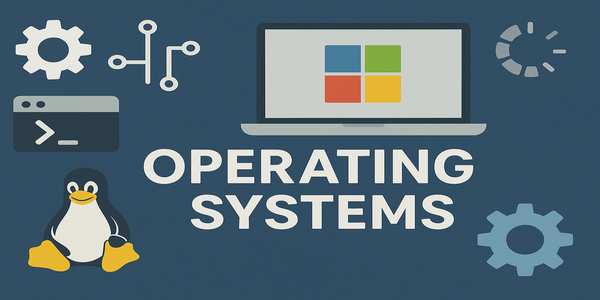

# operating-systems
This is the repository for the Operating Systems course, offered by the Department of Computer Engineering and Automation (DCA) of the Technology Center (CT) at the Federal University of Rio Grande do Norte (UFRN) and taught by professor Dr. Samuel Xavier de Souza and Wedson Torres de Almeida Filho. This space will be used to store all work and projects developed throughout the semester (2025.1) for the course.

Name: Lucas Freire Costa

Undergraduate Course: Computer Engineering
